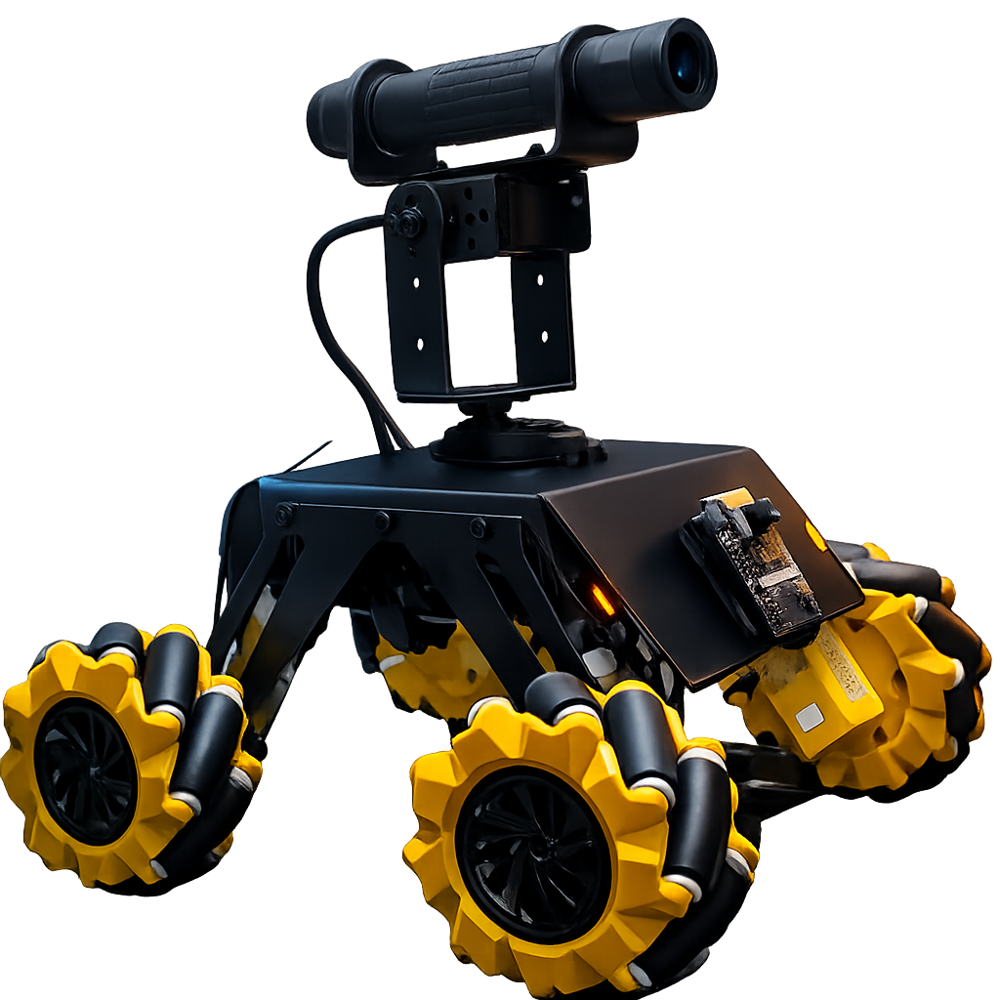

# AGRIS

A computer vision-driven laser targeting system mounted on a remotely controlled mecanum platform. The system detects geometric shapes in a live camera feed and automatically aims a laser at them using a pan/tilt servo gimbal — while a separate subsystem handles omnidirectional drive via a controller.

---

<p align="center">
  
</p>

---

## How it works

Two independent subsystems share the same laser-cut metal frame:

**Vision / Targeting**
The OV2640 camera streams MJPEG video over Wi-Fi to `agris.py` on a Linux host. OpenCV detects target shapes, calculates the angular error from the frame center, and sends absolute servo positions via UDP to the AI-Thinker ESP32. The ESP32 drives two MG996R servos and gates the laser on confirmed lock.

**Drive**
An ESP32-S1 connects to a DualShock 4 over Bluetooth (Bluepad32) and independently drives four mecanum wheels — full omnidirectional movement, strafing, and in-place rotation.

```
OV2640 (fixed to frame)
  → MJPEG stream over Wi-Fi
  → agris.py on PC  (shape detection, FOV-aware proportional control)
  → UDP :4210  →  AI-Thinker ESP32
                    ├── MG996R pan servo   (GPIO 12)
                    ├── MG996R tilt servo  (GPIO 13)
                    └── Laser module       (GPIO 2)

DualShock 4 (Bluetooth)
  → ESP32-S1
      ├── Mecanum FL
      ├── Mecanum FR
      ├── Mecanum RL
      └── Mecanum RR
```

---

## Hardware

| Component | Details |
|---|---|
| Vision + servo controller | AI-Thinker ESP32-CAM (OV2640) |
| Drive controller | ESP32-S1 |
| Camera | OV2640 — QVGA (320×240) for low latency |
| Servos | MG996R × 2 (pan / tilt) |
| Laser | LaserTree LT-40W-F23 (~5 W optical, 12 V / 1.8 A, PWM via signal wire) |
| Controller | DualShock 4 over Bluetooth |
| Frame | Laser-cut metal — DXF files in `CAD_Design/` |

---

## Repository layout

```
agris.py                     Python tracking app (GUI, detection, UDP sender)
AGRIS_AiThinker/
  AGRIS_AiThinker.ino        AI-Thinker firmware (MJPEG stream + UDP + servo/laser)
ESP32S1/
  ESP32S1.ino                Mecanum drive firmware (DualShock 4 → motors)
CAD_Design/
  part-1.dxf
  part-2.dxf
  part-3.dxf
  turret.jpg
```

---

## Setup

**Python dependencies**
```bash
pip install opencv-python numpy pillow requests
```

**Arduino libraries**
`esp32-camera` · `ESP32Servo` · `AsyncUDP` · `Bluepad32`


Flash `AGRIS_AiThinker.ino` to the AI-Thinker board and `ESP32S1.ino` to the drive controller, then run:
```bash
python agris.py
```

---

## Vision pipeline

Adaptive thresholding + contour classification. Detectable shapes:

- Rectangle
- Square
- Circle
- Plus cross `+`
- X cross `×`

Target priority and per-shape enable/disable are configurable at runtime in the GUI.

---

## Communication protocol

UDP packet sent from `agris.py` → ESP32 on port **4210**:

```
PAN:xxxx,TILT:xxxx,LASER:x
```

Values are microseconds for the servo signal. `LASER` is `0` or `1`.

**Servo ranges**

| Axis | Min | Center | Max |
|---|---|---|---|
| Pan | 500 µs | 1632 µs | 2500 µs |
| Tilt | 1050 µs | 1500 µs | 2200 µs |

Tracking uses one-shot absolute positioning — servo angles are computed directly from pixel error and camera FOV, not accumulated incrementally.

---

## Notes

- The laser pin (GPIO 2) is held LOW during boot to prevent accidental firing on startup.
- AI-Thinker board uses `CAMERA_FB_IN_DRAM` with `fb_count=1` (no PSRAM).
- An ESP32-S3 sketch is available as an alternate board target for the vision/servo role.
- The phone camera (IP Webcam → OpenCV HTTP URL) works as a drop-in fallback if the ESP32-CAM is unavailable.
